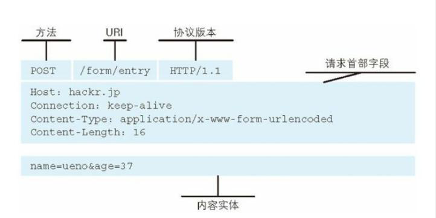
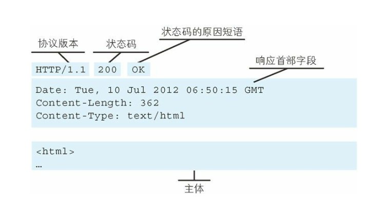
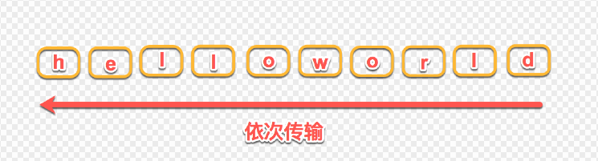

# HTTP & HTTPS

本章内容：
  * [HTTP 请求报文](#http-请求报文)
  * [HTTP 响应报文](#http-响应报文)
  * [HTTP 版本](#http-版本迭代)
    * [HTTP 0.9](#一http09)
    * [HTTP 1.0](#二http10)
    * [HTTP 1.1](#三http11)
    * [HTTP 2.0](#四http2)
  * [HTTP 方法](#http-请求方法)
  * [HTTPS](#https)


## HTTP 请求报文
<div align="center">

</div>

<br>

## HTTP 响应报文
<div align="center">

</div>

<br>
<br>


## HTTP 版本迭代
## 一、HTTP/0.9

HTTP 是基于 TCP/IP 协议的[**应用层协议**](http://www.ruanyifeng.com/blog/2012/05/internet_protocol_suite_part_i.html)。它不涉及数据包（packet）传输，主要规定了客户端和服务器之间的通信格式，默认使用 80 端口。

最早版本是 1991 年发布的 0.9 版。该版本极其简单，只有一个命令`GET`。

> ```
> GET /index.html
> ```

上面命令表示，TCP 连接（connection）建立后，客户端向服务器请求（request）网页`index.html`。

协议规定，服务器只能回应 HTML 格式的字符串，不能回应别的格式。

> ```
> <html>
>   <body>Hello World</body>
> </html>
> ```

服务器发送完毕，就关闭 TCP 连接。


## 二、HTTP/1.0

### 2.1 简介

1996 年 5 月，HTTP/1.0 版本发布，内容大大增加。

1. 首先，任何格式的内容都可以发送。这使得互联网不仅可以传输文字，还能传输图像、视频、二进制文件。这为互联网的大发展奠定了基础。
2. 其次，除了`GET`命令，还引入了`POST`命令和`HEAD`命令，丰富了浏览器与服务器的互动手段。
3. 再次，HTTP 请求和回应的格式也变了。除了数据部分，每次通信都必须包括**头信息**（HTTP header），用来描述一些元数据。
4. 其他的新增功能还包括状态码、多字符集支持、多部分发送、权限、缓存、内容编码等。

### 2.2 请求格式

　　下面是一个 1.0 版的 HTTP 请求的例子。

> ```
> GET / HTTP/1.0
> User-Agent: Mozilla/5.0 (Macintosh; Intel Mac OS X 10_10_5)
> Accept: */*
> ```

　　可以看到，这个格式与 0.9 版有很大变化。第一行是请求命令，必须在尾部添加协议版本（`HTTP/1.0`）。后面就是多行头信息，描述客户端的情况。

### 2.3 回应格式

服务器的回应如下。

> ```
> HTTP/1.0 200 OK 
> Content-Type: text/plain
> Content-Length: 137582
> Expires: Thu, 05 Dec 1997 16:00:00 GMT
> Last-Modified: Wed, 5 August 1996 15:55:28 GMT
> Server: Apache 0.84
> 
> <html>
>   <body>Hello World</body>
> </html>
> ```

回应的格式是"头信息 + 一个空行（`\r\n`） + 数据"。其中，第一行是"协议版本 + 状态码 + 状态描述"。

### 2.4 Content-Type 字段

　　关于字符的编码，1.0 版规定，头信息必须是 ASCII 码，后面的数据可以是任何格式。因此，服务器回应的时候，必须告诉客户端，数据是什么格式，这就是`Content-Type`字段的作用。下面是一些常见的`Content-Type`字段的值。

> - text/plain
> - text/html
> - text/css
> - image/jpeg
> - image/png
> - image/svg+xml
> - audio/mp4
> - video/mp4
> - application/javascript
> - application/pdf
> - application/zip
> - application/atom+xml

　　这些数据类型总称为`MIME type`，每个值包括一级类型和二级类型，之间用斜杠分隔。　　

　　`MIME type`还可以在尾部使用分号，添加参数。下面的类型表明，发送的是网页，而且编码是 UTF-8。

> ```
> Content-Type: text/html; charset=utf-8
> ```

　　客户端请求的时候，可以使用`Accept`字段声明自己可以接受哪些数据格式。

> ```
> Accept: */*
> ```

　　上面代码中，客户端声明自己可以接受任何格式的数据。

### 2.5 缺点

　　HTTP/1.0 版的主要缺点是，每个 TCP 连接只能发送一个请求。发送数据完毕，连接就关闭，如果还要请求其他资源，就必须再新建一个连接。

　　TCP 连接的新建成本很高，因为需要客户端和服务器三次握手，并且开始时发送速率较慢。所以，HTTP 1.0 版本的性能比较差。随着网页加载的外部资源越来越多，这个问题就愈发突出了。

　　为了解决这个问题，有些浏览器在请求时，用了一个非标准的`Connection`字段。

> ```
> Connection: keep-alive
> ```

　　这个字段要求服务器不要关闭 TCP 连接，以便其他请求复用。服务器同样回应这个字段。

> ```
> Connection: keep-alive
> ```

　　一个可以复用的 TCP 连接就建立了，直到客户端或服务器主动关闭连接。但是，这不是标准字段，不同实现的行为可能不一致，因此不是根本的解决办法。


## 三、HTTP/1.1

　　1997 年 1 月，HTTP/1.1 版本发布，只比 1.0 版本晚了半年。它进一步完善了 HTTP 协议，一直用到了 20 年后的今天，直到现在还是最流行的版本。

### 3.1 持久连接

　　1.1 版的最大变化，就是引入了**持久连接**，即 TCP 连接默认不关闭，可以被多个请求复用，不用声明`Connection: keep-alive`。

　　客户端和服务器发现对方一段时间没有活动，就可以主动关闭连接。不过，规范的做法是，客户端在最后一个请求时，发送`Connection: close`，明确要求服务器关闭TCP连接。

> ```
> Connection: close
> ```

### 3.2 管道机制

　　1.1 版还引入了**管道机制**，即在同一个 TCP 连接里面，客户端可以同时发送多个请求。这样就进一步改进了 HTTP 协议的效率。

　　举例来说，客户端需要请求两个资源。以前的做法是，在同一个 TCP 连接里面，先发送 A 请求，然后等待服务器做出回应，收到后再发出 B 请求。管道机制则是允许浏览器同时发出 A 请求和 B 请求，但是服务器还是按照顺序，先回应 A 请求，完成后再回应 B 请求。

### 3.3 其他功能

　　1.1 版还新增了许多动词方法：`PUT`、`PATCH`、`HEAD`、 `OPTIONS`、`DELETE`。

　　另外，客户端请求的头信息新增了`Host`字段，用来指定服务器的域名。

> ```
> Host: www.example.com
> ```

　　有了`Host`字段，就可以将请求发往同一台服务器上的不同网站，为虚拟主机的兴起打下了基础。

### 3.5 缺点

　　虽然 1.1 版允许复用 TCP 连接，但是同一个 TCP 连接里面，所有的数据通信是按次序进行的。服务器只有处理完一个回应，才会进行下一个回应。要是前面的回应特别慢，后面就会有许多请求排队等着。这称为["队头堵塞"](https://zh.wikipedia.org/wiki/%E9%98%9F%E5%A4%B4%E9%98%BB%E5%A1%9E)（Head-of-line blocking）。

　　为了避免这个问题，只有两种方法：一是减少请求数，二是同时多开持久连接。这导致了很多的网页优化技巧，比如合并脚本和样式表、将图片嵌入 CSS 代码、域名分片（domain sharding）等等。如果 HTTP 协议设计得更好一些，这些额外的工作是可以避免的。


### 3.6 HTTP1.1 和 1.0 的区别

* 缓存处理：在 HTTP1.0 中主要使用 header 里的 `If-Modified-Since`，`Expires` 来做为缓存判断的标准，HTTP1.1 则引入了更多的缓存控制策略例如 `Entity tag`，`If-Unmodified-Since`，` If-Match`，` If-None-Match` 等更多可供选择的缓存头来控制缓存策略。（关于[缓存](https://github.com/TanYJie/Technology-Stack/blob/master/服务端与网络/缓存.md)）
* 长连接：HTTP 1.1 支持长连接和请求的流水线处理，在一个 TCP 连接上可以传送多个 HTTP 请求和响应，减少了建立和关闭连接的消耗和延迟，在HTTP1.1 中默认开启 `Connection: keep-alive`，一定程度上弥补了 HTTP1.0 每次请求都要创建连接的缺点。


<br>


## 四、HTTP/2

　　2015 年，HTTP/2 发布。它不叫 HTTP/2.0，是因为标准委员会不打算再发布子版本了，下一个新版本将是 HTTP/3。

### 4.1 二进制协议

　　HTTP/1.1 版的头信息肯定是文本（ASCII 编码），数据体可以是文本，也可以是二进制。HTTP/2 则是一个彻底的二进制协议，头信息和数据体都是二进制，并且统称为"帧"（frame）：头信息帧和数据帧。

　　二进制协议的一个好处是，可以定义额外的帧。HTTP/2 定义了近十种帧，为将来的高级应用打好了基础。如果使用文本实现这种功能，解析数据将会变得非常麻烦，二进制解析则方便得多。


### 4.2 多工

　　HTTP/2 复用 TCP 连接，在一个连接里，客户端和浏览器都可以同时发送多个请求或回应，而且不用按照顺序一一对应，这样就避免了"队头堵塞"。

　　举例来说，在一个 TCP 连接里面，服务器同时收到了 A 请求和 B 请求，于是先回应 A 请求，结果发现处理过程非常耗时，于是就发送 A 请求已经处理好的部分， 接着回应 B 请求，完成后，再发送 A 请求剩下的部分。

　　这样双向的、实时的通信，就叫做**多工**（Multiplexing）。


### 4.3 数据流

　　因为 HTTP/2 的数据包是不按顺序发送的，同一个连接里面连续的数据包，可能属于不同的回应。因此，必须要对数据包做标记，指出它属于哪个回应。

　　但 HTTP/2 的数据包支持不按顺序发送，它对每个数据包做了标记，指出它属于哪个回应。

　　HTTP/2 将每个请求或回应的所有数据包，称为一个数据流（stream）。每个数据流都有一个独一无二的编号。数据包发送的时候，都必须标记数据流 ID，用来区分它属于哪个数据流。另外还规定，客户端发出的数据流，ID 一律为奇数，服务器发出的，ID 为偶数。

　　数据流发送到一半的时候，客户端和服务器都可以发送信号（`RST_STREAM`帧），取消这个数据流。1.1 版取消数据流的唯一方法，就是关闭 TCP 连接。这就是说，HTTP/2 可以取消某一次请求，同时保证 TCP 连接还打开着，可以被其他请求使用。

　　客户端还可以指定数据流的优先级。优先级越高，服务器就会越早回应。


### 4.4 头信息压缩

　　HTTP 协议不带有状态，每次请求都必须附上所有信息。所以，请求的很多字段都是重复的，比如`Cookie`和`User Agent`，一模一样的内容，每次请求都必须附带，这会浪费很多带宽，也影响速度。

　　HTTP/2 对这一点做了优化，引入了**头信息压缩机制**。一方面，头信息使用`gzip`或`compress`压缩后再发送；另一方面，客户端和服务器同时维护一张头信息表，所有字段都会存入这个表，生成一个索引号，以后就不发送同样字段了，只发送索引号，这样就提高速度了。


### 4.5 服务器推送

　　HTTP/2 允许服务器未经请求，主动向客户端发送资源，这叫做**服务器推送**（server push）。

　　常见场景是客户端请求一个网页，这个网页里面包含很多静态资源。正常情况下，客户端必须收到网页后，解析 HTML 源码，发现有静态资源，再发出静态资源请求。其实，服务器可以预期到客户端请求网页后，很可能会再请求静态资源，所以就主动把这些静态资源随着网页一起发给客户端了。


### 4.6 多路复用

　　多路复用是指**以同一线路承载多路信号进行通信**的方式。各路信号在送往传输媒质以前，需按一定的规则进行调制，以利于各路已调信号在媒质中传输，并不致混淆，从而在传到对方时使信号具有足够能量，且可用反调制的方法加以区分、恢复成原信号。多路复用常用的方法有频分多路复用和时分多路复用，码分多路复用的应用也在不断扩大。

　　在 HTTP1.1 的协议中，我们传输的 request 和 response 都是基本于文本的，这样就会引发一个问题：所有的数据必须按顺序传输，比如需要传输：hello world，只能从 h 到 d 一个一个的传输，不能并行传输，因为接收端并不知道这些字符的顺序，所以并行传输在 HTTP1.1 是不能实现的。

<div align="center">

</div>

　　HTTP/2 引入二进制数据帧和流的概念，其中帧对数据进行顺序标识，如下图所示，这样浏览器收到数据之后，就可以按照序列对数据进行合并，而不会出现合并后数据错乱的情况。同样是因为有了序列，服务器就可以并行的传输数据，这就是流所做的事情。

<div align="center">

</div>


<br>


<br>

## HTTP 请求方法
* `GET`：获取资源
* `POST`：向指定资源提交实体数据（例如提交表单或者上传文件）。数据被包含在请求体中。POST 请求可能会导致新的资源的建立/已有资源的修改。
* `HEAD`：获得报文首部。用于确认 URI 的有效性及资源更新的日期时间等
* `PUT`：从客户端向服务器传送的数据取代指定的文档的内容。PUT 方法用来传输文件，要求在请求报文的主体中包含文件内容，然后保存在请求 URI 指定的位置。但是 HTTP/1.1 的 PUT 方法自身不带验证机制，任何人都可以上传文件，存在安全问题，故一般不用。
* `DELETE`：删除资源
* `OPTIONS`：查询支持的方法。查询指定的 URL 能够支持的方法。
* `TRACE`：追踪路径。服务器会将通信路径返回给客户端。发送请求时，在 `Max-Forwards` 首部字段中填入数值，每经过一个服务器就会减 1，当数值为 0 时就停止传输。
* `CONNECT`：HTTP/1.1 协议中预留给能够将连接改为管道方式的代理服务器。在与代理服务器通信时建立隧道，实现用隧道协议进行 TCP 通信。主要使用 SSL（安全套接层）和 TLS（传输层安全）协议把通信内容加密后经网络隧道传输。


<br>
<br>

## HTTPs
HTTP 有以下安全性问题：
1. 通信使用明文，内容可能会被窃听；
2. 不验证通信方的身份，因此有可能遭遇伪装；
3. 无法证明报文的完整性，所以有可能已遭篡改。

　　HTTPs 并不是新协议，而是 HTTP 先和 SSL（Secure Socket Layer）通信，再由 SSL 和 TCP 通信。通过使用 SSL，HTTPs 提供了加密、认证和完整性保护。通过使用 **证书** 来对通信方进行认证。证书中有公开密钥数据，如果可以验证公开密钥的确属于通信方的，那么就可以确定通信方是可靠的。

　　数字证书认证机构（CA，Certificate Authority）颁发的公开密钥证书，可以通过 CA 对其进行验证。进行 HTTPs 通信时，服务器会把证书发送给客户端，客户端取得其中的公开密钥之后，就可以开始加密过程。

<div align="center">

</div>


## HTTPS 保证数据安全的机制：
首先科普一下 **对称加密** 和 **非对称加密**:
* 对称加密：加密与解密用的是 **同样的密钥** ，常见的对称加密算法有 DES、3DES、Blowfish、RC4、RC5、RC6、AES 
* 非对称加密：加密与解密用的是 **不同的密钥**。这对密钥被称为 **公钥** 和 **私钥**。非对称加密算法有 RSA

#### HTTPS 具体过程
1. 客户端向服务器端发起 SSL 连接请求；（在此过程中依然存在数据被中间方盗取的可能，下面将会说明如何保证此过程的安全）
2. 服务器把公钥发送给客户端，并且服务器端保存着唯一的私钥；
3. 客户端用公钥对双方通信的对称秘钥进行加密，并发送给服务器端；
4. 服务器利用自己唯一的私钥对客户端发来的对称秘钥进行解密，在此过程中，中间方无法对其解密（即使是客户端也无法解密，因为只有服务器端拥有唯一的私钥），这样保证了对称秘钥在收发过程中的安全，此时，服务器端和客户端拥有了一套完全相同的对称秘钥。
5. 进行数据传输，服务器和客户端双方用公有的相同的对称秘钥对数据进行加密解密，可以保证在数据收发过程中的安全，即是第三方获得数据包，也无法对其进行加密，解密和篡改。

简单的来说，就是先通过 **非对称加密** 获得 **密钥**，之后用此密钥对数据进行 **对称加密**。


## CA（电子商务认证机构）认证作用： 
　　在上面提到的 客户端向服务器端发起请求时存在数据被盗取的过程：假如服务器端经由中间方向客户端发送公钥的时候，中间方没有将公钥发送给客户端，而是伪造了一对公钥，并将伪造的公钥发送给客户端，此时客户端用中间方伪造的公钥对自己正确的对称秘钥加密并由中间方发送给服务器端，而中间方将用自己伪造的公钥的私钥对其进行解密，得到正确的对称秘钥，并将得到的正确的对称秘钥用服务器端发过来的公钥进行加密发给服务器端，服务器再用正确的私钥进行解密，也得到正确的对称秘钥，此时客户端，服务器端，中间方三者都拥有一套正确的对称秘钥，可以对传送的数据进行加密，解密。

　　为了解决上述问题，一般情况下，服务器端会向 CA 申请认证书，此证书包含了 CA 及服务器端的一些信息（可以理解为类似公章），这样，服务器端将证书发给客户端的过程中，中间方是无法伪造的，保证了，发给客户端的公钥是服务器端发送的。

<br>
<br>

### 参考文献
 * [HTTP 0.9 - HTTP 2.0 发展史](http://www.ruanyifeng.com/blog/2016/08/http.html)
