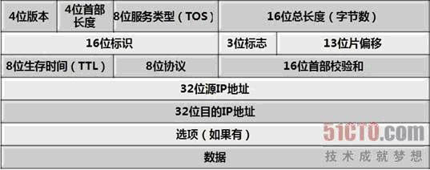
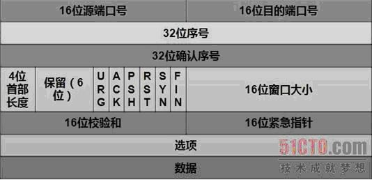

# TCP

### IP 数据报头部

  

 

### UDP 数据报头部

  

 

### TCP 数据报头部

  

`1、端口号`：用来标识同一台计算机的不同的应用进程。
  * 源端口：源端口和IP地址的作用是标识报文的返回地址。
  * 目的端口：端口指明接收方计算机上的应用程序接口。

`2、序列号和确认号`：是 TCP 可靠传输的关键部分。序列号是本报文段发送的数据组的第一个字节的序号。在 TCP 传送的流中，每一个字节一个序号。确认号，即 ACK，指明下一个期待收到的字节序号，表明该序号之前的所有数据已经正确无误的收到。

`3、数据偏移／首部长度`：4bits。由于首部可能含有可选项内容，因此 TCP 报头的长度是不确定的，报头不包含任何任选字段则长度为 20 字节，4 位首部长度字段所能表示的最大值为 1111，转化为 10 进制为15，15*32/8 = 60，故报头最大长度为 60 字节。首部长度也叫数据偏移，是因为首部长度实际上指示了数据区在报文段中的起始偏移值。

`4、保留`：为将来定义新的用途保留，现在一般置 0。

`5、控制位`：共 6 个，每一个标志位表示一个控制功能。
  * URG：紧急指针标志，为 1 时表示紧急指针有效，为 0 则忽略紧急指针。
  * ACK：确认序号标志，为 1 时表示确认号有效，为 0 表示报文中不含确认信息，忽略确认号字段。
  * PSH：push 标志，为 1 表示是带有 push 标志的数据，指示接收方在接收到该报文段以后，应尽快将这个报文段交给应用程序，而不是在缓冲区排队。
  * RST：重置连接标志，用于重置由于主机崩溃或其他原因而出现错误的连接。或者用于拒绝非法的报文段和拒绝连接请求。
  * SYN：同步序号，用于建立连接过程。
  * FIN：finish 标志，用于释放连接，为 1 时表示发送方已经没有数据发送了，即关闭本方数据流。

`6、窗口`：滑动窗口大小，用来告知发送端接受端的缓存大小，以此控制发送端发送数据的速率，从而达到流量控制。窗口大小时一个 16bit 字段，因而窗口大小最大为65535。

`7、校验和`：奇偶校验，此校验和是对整个的 TCP 报文段，包括 TCP 头部和 TCP 数据，以 16 位字进行计算所得。由发送端计算和存储，并由接收端进行验证。

`8、紧急指针`：只有当 URG 标志置 1 时紧急指针才有效。紧急指针是一个正的偏移量，和顺序号字段中的值相加表示紧急数据最后一个字节的序号。TCP 的紧急方式是发送端向另一端发送紧急数据的一种方式。

`9、选项和填充`

`10、数据部分`： TCP 报文段中的数据部分是可选的。在一个连接建立和一个连接终止时，双方交换的报文段仅有 TCP 首部。如果一方没有数据要发送，也使用没有任何数据的首部来确认收到的数据。在处理超时的许多情况中，也会发送不带任何数据的报文段。

 

### TCP 和 UDP 的区别
* TCP 面向连接（三次握手），通信前需要先建立连接；UDP 面向无连接，通信前不需要连接。
* TCP 通过序号、重传、流量控制、拥塞控制实现可靠传输；UDP 不保障可靠传输，尽最大努力交付。
* TCP 面向字节流传输，因此可以被分割并在接收端重组；UDP 面向数据报传输。

 

### 三次握手

  

 

### TCP 为什么不是两次握手而是三次？
　　如果仅两次连接可能出现一种情况：客户端发送完连接报文（第一次握手）后由于网络不好，延时很久后报文到达服务端，服务端接收到报文后向客户端发起连接（第二次握手）。此时客户端会认定此报文为失效报文，但在两次握手情况下服务端会认为已经建立起了连接，服务端会一直等待客户端发送数据，但因为客户端会认为服务端第二次握手的回复是对失效请求的回复，不会去处理。这就造成了服务端一直等待客户端数据的情况，浪费资源。

 

### 四次挥手

  

 

### TCP 为什么挥手是四次而不是三次？
　　TCP 是全双工的，它允许两个方向的数据传输被独立关闭。当主动发起关闭的一方关闭连接之后，TCP 进入半关闭状态，此时主动方可以只关闭输出流。
之所以不是三次而是四次主要是因为被动关闭方将"对主动关闭报文的确认"和"关闭连接"两个操作分两次进行。
对主动关闭报文的确认是为了快速告知主动关闭方，此关闭连接报文已经收到。此时被动方不立即关闭连接是为了将缓冲中剩下的数据从输出流发回主动关闭方（主动方接收到数据后同样要进行确认），因此要把"确认关闭"和"关闭连接"分两次进行。

 
