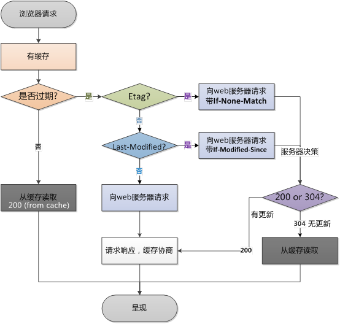

# 缓存

## 强缓存-Expires


实现强缓存可以通过两种响应头实现：Expires 和 Cache-Control 。强缓存表示在缓存期间不需要请求，state code 为 200
```
Expires: Wed, 22 Oct 2018 08:41:00 GMT
```

Expires 是 HTTP / 1.0 的产物，表示资源会在 Wed, 22 Oct 2018 08:41:00 GMT 后过期，需要再次请求。并且 Expires 受限于本地时间，如果修改了本地时间，可能会造成缓存失效。


## 强缓存-Cache-control
```
Cache-control: max-age=30
```
Cache-Control 出现于 HTTP / 1.1，优先级高于 Expires 。以下是 Cache-Control 的一些选项：

|Cache-directive|	说明|
| --- | --- |
|public|	所有内容都将被缓存（客户端和代理服务器都可缓存）|
|private	| 内容只缓存到私有缓存中（仅客户端可以缓存，代理服务器不可缓存）|
|no-cache	| 必须先与服务器确认返回的响应是否被更改，然后才能使用该响应来满足后续对同一个网址的请求。因此，如果存在合适的验证令牌 （ETag），no-cache 会发起往返通信来验证缓存的响应，如果资源未被更改，可以避免下载。|
|no-store	| 所有内容都不会被缓存到缓存或 Internet 临时文件中|
|must-revalidation/proxy-revalidation	|如果缓存的内容失效，请求必须发送到服务器/代理以进行重新验证|
|max-age=xxx |	缓存的内容将在 xxx 秒后失效, 这个选项只在 HTTP 1.1 可用, 并如果和 Last-Modified 一起使用时, 优先级较高|


<br>

## 对比缓存
　　在没有走强缓存逻辑的情况下，服务器端会进行 `Last-Modified` 和 `Etag` 的校验，如果校验发现资源未更新，则会返回 **304** ，否则会返回新的资源实体。

### 对比缓存-Etag
　　首部字段 ETag 能告知客户端实体标识。它是一种可将资源以字符串形式做唯一性标识的方式。服务器会为每份资源分配对应的 ETag 值。当资源更新时，ETag 值也需要更新。生成 ETag 值时，并没有统一的算法规则，而仅仅是由服务器来分配。

　　比较过程：
  * 当你第一次发起 HTTP 请求时，服务器会返回一个 Etag
  * 在你第二次发起同一个请求时，客户端会同时发送一个 If-None-Match，而它的值就是 Etag 的值（此处由发起请求的客户端来设置）。
  * 然后，服务器会比对这个客服端发送过来的 Etag 是否与服务器的相同
    * 如果相同，就将 If-None-Match 的值设为 false，返回状态码为 304，客户端继续使用本地缓存
    * 如果不相同，就将 If-None-Match 的值设为 true，返回状态为 200，客户端重新解析服务器返回的数据

### 对比缓存-Last-Modified/If-Modified-Since
* Last-Modified：由服务器发送给客户端，表示这个响应资源的最后修改时间。 
* If-Modified-Since：由客户端发送给服务器，表示本地浏览器存储的文件修改时间。

　　比较过程：  
* 当你第一次发起 HTTP 请求时，服务器会返回一个 Last-Modified
* 在你第二次发起同一个请求时，客户端会同时发送一个 If-Modified-Since，它的值是本地浏览器存储的文件修改时间。
* 服务器比对
  * 如果两个时间相等，返回状态码为 304，客户端继续使用本地缓存
  * 如果 Last-Modified 时间更晚，返回状态为 200，客户端重新解析服务器返回的数据

<br>

### 流程图
<div align="center">
  
</div>

